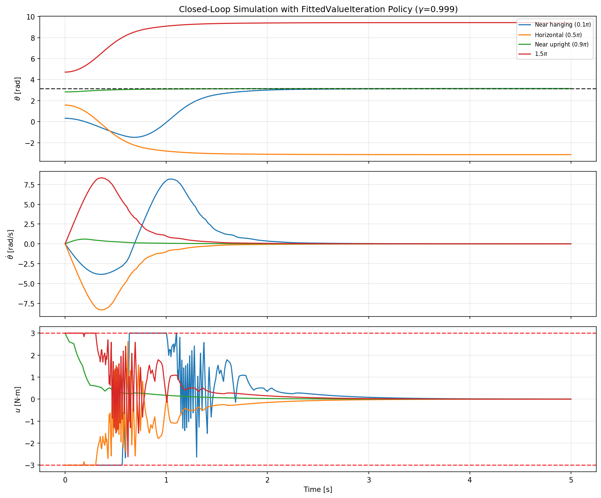
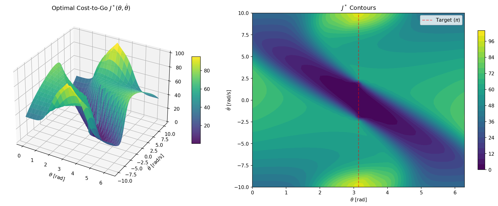
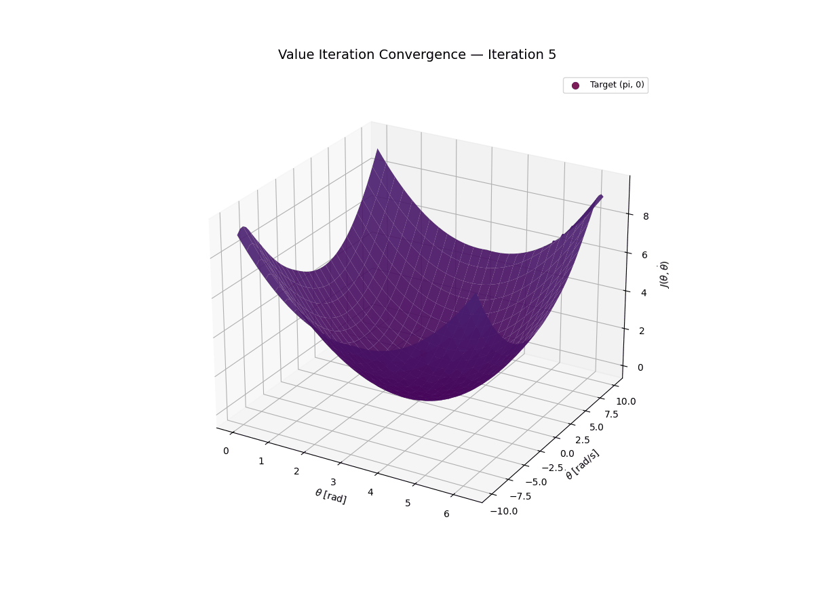
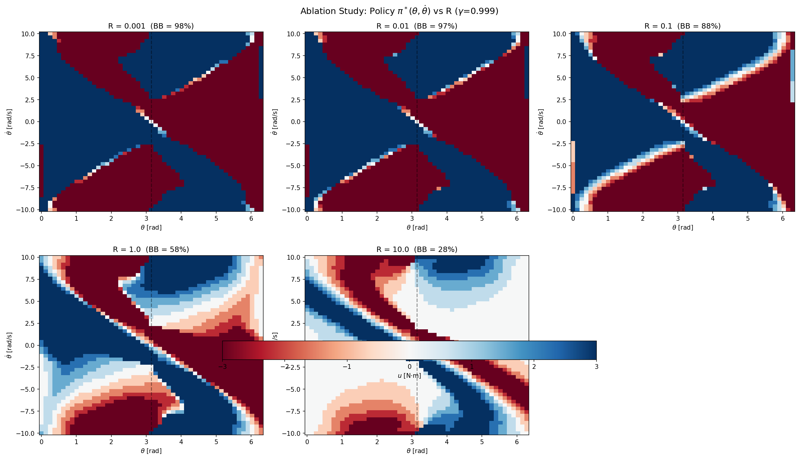
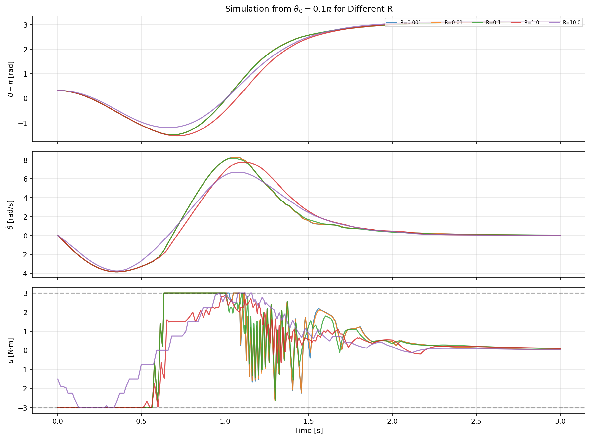
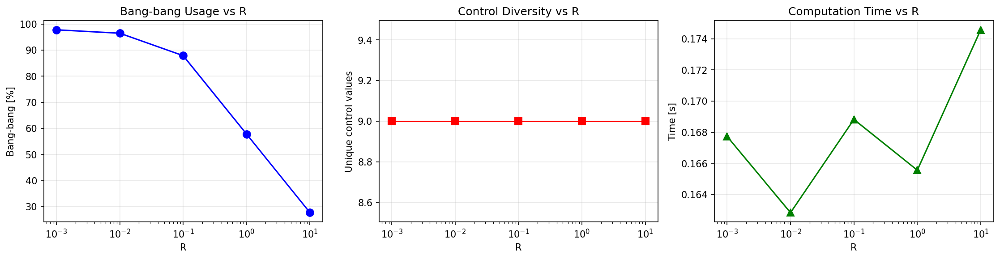
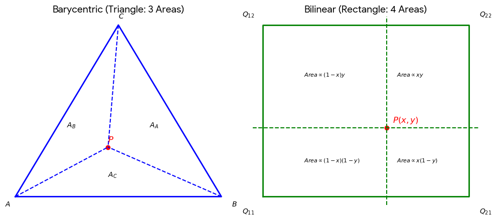

# 课程设计报告

**项目名称**：Project 2：基于价值迭代的倒立摆全局最优控制  

**学生姓名**：李政毅  
**学号**：2024312134  
**完成日期**：2026/5/24

---

## 摘要
本项目致力于研究如何**针对简单倒立摆对象得到基于价值迭代算法的全局最优控制策略**。通过动态规划，利用基于Value Iteration算法设计并计算状态空间中任一点抵达$((2k+1)\pi,0)$——即倒立状态并稳定——的最小代价函数，从代价函数中提取对应的最优控制策略，实现：从任意状态空间出发，摆都能抵达倒立点并维持稳定，可以根据不同需求（如用时优先，能耗/输出限幅优先）设置不同策略。项目的关键创新在于：使用离散网格化的状态空间并重心插值，用离散的图搜索而不是连续空间的哈密顿-雅可比-贝尔曼方程简化运算，并引入指数折现因子$\gamma$来保证策略的收敛。  
**关键词**：倒立摆，动态规划，价值迭代，离散空间  

---

## 1. 引言

### 1.1 项目背景与意义
倒立摆是控制理论中的经典问题。其竖直向上平衡点$((2k+1)\pi,0)$不稳定——其相图梯度场在该点有小于0的斜率，任何微小的角度偏移都会导致摆加速坠落。使摆从任意初始状态到达并保持在这个不稳定平衡点上，对控制算法提出了严格的要求：它要求控制器既能处理大范围非线性摆动（远离目标时的能量注入），又能在目标附近提供精确镇定。  
传统方法倾向采用能量整形控制与目标点附近局部线性化结合方案。前者通过多次加速解决在输出力矩限幅的前提下单摆如何摆到目标点附近的问题，后者解决单摆如何在目标平衡点附近保持稳定。  
动态规划为非线性最优控制提供了理论完备的框架。贝尔曼最优性原理将多步决策问题分解为单步优化子问题的递归结构。Value Iteration是求解贝尔曼方程的经典算法，通过在离散化状态空间上反复应用贝尔曼算子，最终收敛到全局最优代价函数 $J^*$ （仅差常数项）和相应的最优策略 $\pi^*$。与依赖局部线性化或特定初始猜测的方法不同，价值迭代给出的是全局最优解——状态空间中每一个点的最优控制动作都被明确计算。
### 1.2 相关研究现状
本项目基于 MIT 课程 *Underactuated Robotics*的 *单摆* 、 *从体操机器人、小车摆到四旋翼无人机*与 *动态规划* 章节。课程提供了 pydrake 计算库，其中 `FittedValueIteration` 封装了在连续状态空间离散网格上的价值迭代算法，并采用重心插值在三角化的单纯形网格上做策略表示。  
课程的双积分器示例（[Chapter 7: Dynamic Programming](https://underactuated.mit.edu/dp.html)）和配套的示例代码[on_a_mesh.ipynb](https://deepnote.com/workspace/Underactuated-2ed1518a-973b-4145-bd62-1768b49956a8/project/526ff99b-f112-4247-9b0b-c52f0f88d6ce/notebook/on_a_mesh-44aac282aa1a436aafb2ac6ced3f1ccb)展示了最小时间代价与二次型代价分别产生 bang-bang 控制与平滑控制的对比。本项目将该分析框架扩展到简单倒立摆的 swing-up 问题。
### 1.3 报告结构安排
- 第二节：系统建模
    - 简单倒立摆系统描述
    - 状态空间离散化
- 第三节：控制器与算法设计
    - Value Iteration原理
    - 成本函数设计
    - 参数整定依据
- 第四节：仿真实现
    - 使用的仿真工具
    - 代码结构与调用说明
    - 可视化交互演示
- 第五节：实验结果与分析
    - 典型成功轨迹
    - 输出代价消融实验
- 第六节：结论与展望
---

## 2. 系统建模与动力学推导

### 2.1 简单倒立摆系统描述
给定一个单摆，质量 $m$ 集中于末端的重物（可视作质点）。重物与旋转轴间有一长度为 $l$ 的轻绳相连，以绳与摆自然下垂时状态的夹角为 $\theta$ ，夹角沿逆时针方向生长。 外界可以向系统输入力矩 $u$ ，逆时针为正。 $u$ 的大小不超过 $u_{max}$，并考虑正比于速度的阻力 。  
<div style="text-align: center;">

  
*Fig 2.1 - 简单倒立摆图示*
</div>

系统的拉格朗日方程为  
$$ml^2\ddot{\theta}+mgl\mathrm{sin}\theta=u-b\dot{\theta}$$
在模型的设定中，输入力矩限制应使系统为欠驱动系统，存在无法直接输入 $\{-u_{min},u_{max}\}$ 抵达目标 $((2k+1)\pi,0)$ 的状态。  

<div style="width: max-content; margin: 0 auto;">

| 参数 | 符号 | 数值 | 单位 |
| ---- | ---- | ---- | ---- |
| 质量     | m  | 1.0  | kg  |
| 绳长     | l  | 0.5  | m   |
| 阻尼系数 | b  | 0.1  | N\*m\*s |
| 重力加速度| g | 9.81 | m/s^2|
|输入扭矩限幅|$u_{max}$|3.0|N\*m|
|角速度限幅 | $\dot{\theta}$ | 10.0 | rad/s |

</div>
<div style="text-align: center;">

*Tab 2.1 - 系统物理参数*

</div>

状态空间 $\mathbf{x}=(\theta,\dot{\theta})^{T}=(x_1,x_2)^{T}$ ，视$\theta$和$\dot{\theta}$独立，则  
$$
\mathbf{\dot{x}}=f(\mathbf{x},u)
=
\begin{bmatrix}
x_2 \\
 \frac{1}{ml^2}(u-bx_2-mgl\mathrm{sin}x_1)
 \end{bmatrix}
 $$

### 2.2 状态空间离散网格化描述  
固定$\dot{\theta}$，可以注意到从$(\theta,\dot{\theta})$到$(\pi,0)$和从$(\theta +2k\pi,\dot{\theta})$到$((2k+1)\pi,0)$有相同的最优控制策略。于是施加一个循环映射，把$\theta$限定在$[0,2\pi)$，目标角度统一为 $\pi$ ，可以减轻策略求解计算量。  
参考Russ Tedrake教授在示例程序中的网格化方式，将 $\theta \in [0,2\pi]$ 均匀划分为51个点、50区间；将 $\dot{\theta}\in [-10,10]$ 也划分为51个点、50区间。然后，将这些点组合成 $51\times 51$ 共2061点的状态空间网格。第i行第j列状态可以表示为  
$$
x_{ij}=\begin{bmatrix}\theta_i \\ \dot{\theta}_j \end{bmatrix}=\begin{bmatrix}
\frac{(i-1)\pi}{25} \\
\frac{2(j-1)}{5}-10
\end{bmatrix}
$$  
这些点之间有步长 $\Delta{\theta}=\frac{\pi}{25},\Delta{\dot{\theta}}=0.4$ .  
参考Tedrake教授在示例程序中的网格化方式，将 $u \in [-3,3]$ 均匀划分为9个点、8区间。 $\dot{\mathbf{x}}=f(\mathbf{x},u)$ 可以改写为  
$$
\dot{\mathbf{x}}_{ijk}
=
f(\mathbf{x}_{ij},u_k)
$$  
原先状态空间平面内的点 $\mathbf{x}=(\theta,\dot{\theta})^{T}$ 可以用离之最近的3个点 $\mathbf{x_1},\mathbf{x_2},\mathbf{x_3}\in\mathbb{R}^{2}$ 围成的三角形面和权重 $\mathbf{\lambda}=(\lambda_1,\lambda_2,\lambda_3)^{T}$ 描述。  

$$
\left\{\begin{array}{l}
\mathbf{x}=\lambda_1\mathbf{x_1}+\lambda_2\mathbf{x_2}+\lambda_3\mathbf{x_3}\\
\lambda_1+\lambda_2+\lambda_3\\
\lambda_1,\lambda_2,\lambda_3\in{[0,1]}
\end{array}\right.
$$

$\mathbf{\lambda}$ 就是线性方程组
$$
\begin{bmatrix}\mathbf{x}_1&\mathbf{x}_2&\mathbf{x}_3\\
1&1&1\end{bmatrix}\mathbf{\lambda}=\begin{bmatrix}\mathbf{x}\\1\end{bmatrix}
$$
的解。

---

## 3. 控制器 / 算法设计

### 3.1 价值迭代最优策略设计原理
离散网格化状态空间可以视作一组有向图。设状态 $\mathbf{x}[n]$ 输入动作 $u[n]$ 后变为状态 $\mathbf{x}[n+1]$ ，则转移动力学可表示为  
$$\mathbf{x}[n+1]=f(\mathbf{x}[n],u[n])$$
在简单倒立摆的情景中，令时间步长为 $\Delta{t}$ ,转移动力学可以具体表示为  
$$f_{d}(\mathbf{x},u)=\mathbf{x}+\dot{\mathbf{x}}=\mathbf{x}+\Delta{t}f(\mathbf{x},u)$$
$$
\left\{
    \begin{array}{l}
    \theta_d=\theta+\Delta{t}\dot{\theta}\\
    \dot{\theta}_d=\frac{\Delta{t}}{ml^2}(u-b\dot{\theta}-mgl\mathrm{sin}\theta)
    \end{array}
\right.
$$
与之对应，这个转移操作的代价可以表示为 $\ell(\mathbf{x}[n],u[n])$. 令从 $\mathbf{x}[n]$ 到目标的最小代价为 $J(\mathbf{x}[n])$ ，从 $\mathbf{x}[n+1]$ 到目标的最小代价为 $J(\mathbf{x}[n+1])$ ， 当 $u[n]$ 在从 $\mathbf{x}[n]$ 出发的最优路径上时，应当满足  
$$
J(\mathbf{x}[n]) = \ell(\mathbf{x}[n],u[n]) + J(\mathbf{x}[n+1])
$$
尽管实际情况中 $u[n]$ 不一定在从 $\mathbf{x}[n]$ 出发的最优路径上，仍然可以递归地求解每个节点状态到目标的最优代价函数 $J^{*}(\mathbf{x})$ ——部署最优策略时累计的每步代价——然后提取每步的  $u$ 来找到从每个节点状态出发的最优路径。  
典型的值迭代算法，首先将所有的 $\mathbf{x}$ ，其对应的代价函数估计值赋值 $\hat{J}^{*}(\mathbf{x})=0$.（值得一提的是，在很多变种算法中，这个初始值是  $\infty$） 接着，对每一个节点的代价函数迭代式更新  
$$
\forall i, \hat{J}^{*}(\mathbf{x}_i) := \mathrm{min}\left[\ell(\mathbf{x},u)+\hat{J}^{*}(f(\mathbf{x}_i,u))\right]
$$

迭代的边界条件设为  

$$
\hat{J}^{*}(\mathbf{x}_{dst})=0
$$

在数值线性代数方法中， $\hat{J}^{*}(\mathbf{x})$ 可以表示为一个矩阵（在这个例子中，是一个$51\times 51$的方阵），每运行一次迭代，矩阵每个元素都被更新一次。观察多次迭代 $\hat{J}^{*}(\mathbf{x})$ 的变化，非零值应该从目标状态附近开始出现，并逐渐增长、向远端扩散。可以证明估计值能够收敛到最优代价函数真实值差一个常数。  
$$\hat{J}^{*}\rightarrow J^{*}+c$$
但在我们的场景中，输入的力矩也是离散的，系统在接近目标状态后大概率会围绕目标点震颤。随着时间的推迟，迭代次数的增加，$\hat{J}^{*}\rightarrow\infty$. 一个解决办法是人为减小接近终点时迭代结果的权重，是迭代强行收敛，典型做法是向积分/累加中乘上一个指数衰减因子 $0<\gamma<1$ ，第n步迭代时的转移操作代价与使用因子修正前相比  
$$\ell^{\prime}(\mathbf{x}[n],u[n])=\gamma^{n}\ell(\mathbf{x}[n],u[n])$$
贝尔曼迭代方程可以写为  
$$
\hat{J}^{*}(\mathbf{x}) = \underset{\mathrm{min}}{u}\left[\ell(\mathbf{x},u)+\gamma\hat{J}^{*}(f(\mathbf{x},u))\right]
$$
在我们建立的网格化状态空间中， $f(\mathbf{x}[n],u[n])$ 并不必然也落在网格的离散点上。更一般的情况是：转移操作的结果落在离其最近的三个点围成的三角形面内。非网格上点的代价函数如何定义？利用先前在离散网格中定义的权重，可以使用重心插值法局部线性化代价函数。如此，便能将代价函数网络连续化。

$$
\hat{J}^{*}(\mathbf{x})=<\mathbf{\lambda},(\hat{J}^{*}(\mathbf{x_1}),\hat{J}^{*}(\mathbf{x_2}),\hat{J}^{*}(\mathbf{x_3}))^{T}>
$$

得到最优代价函数 ${J}^{*}$ 后，便可以提取最优策略 $u_{opt}=\pi^{*}(\mathbf{x})$. 对于状态点$\mathbf{x}$，探索所有51种输出中使转移操作代价和转移后长期代价直和最少的那一个输出。这种方法本质上与连续函数的梯度求解类似。  
$$
\pi^{*}(\mathbf{x})=\mathrm{argmin}_{u}\left[\ell(\mathbf{x},u)+J^{*}(f(\mathbf{x},u))\right]
$$

### 3.2 成本函数设计
**残差惩罚项**  
定义残差  
$$\mathbf{\tilde{x}}=\mathbf{x}-(\pi,0)^{T}$$
残差二次型  
$$\mathbf{\tilde{x}}^{T}\mathbf{Q}\mathbf{\tilde{x}}$$
$$\mathbf{Q}=\begin{bmatrix}Q_{t}&\\&Q_{dt}\end{bmatrix}\in \mathbb{R}_{2\times 2}$$

**输入限幅项**  
输入二次型  
$$\mathbf{u}^{T}\mathbf{R}\mathbf{u}=Ru^2$$
**成本函数**  
$$
g(\mathbf{x},u)
=
\mathbf{\tilde{x}}^{T}\mathbf{Q}\mathbf{\tilde{x}}+
\mathbf{u}^{T}\mathbf{R}\mathbf{u}
=Q_{t}(\theta-\pi)^2+Q_{dt}\dot{\theta}^2+Ru^2
$$
在本场景中，选定基线参数 $Q_t=10.0, Q_{dt}=1.0, R=0.1$


### 3.3 参数整定依据
**单摆物理参数 $m,g,l,b$**  
仿真库Pydrake在pydrake.examples中提供了单摆的实例PendulumPlant，这个实例中默认选取
$m=1kg, l=0.5m, b=0.1Nm/s, g=9.81m/s^2$  
**输入力矩限幅 $u_{max}$**  
当摆荡到角度 $\theta=\frac{\pi}{2}$ 时，重力矩 $M_g=mgl\approx4.9>u_{max}=3$. 这就使得摆不可能从底端一步荡到倒立位置，构造非完整约束，满足了系统的欠驱动性。  
**指数衰减因子 $\gamma$**  
把供摆抵达目标状态的时间限制在10s内（稍后可以在仿真看到，实际用时可以短得多）。在仿真中，时间步长 $\Delta{t}=0.01s$ ，我们需要模拟 $\frac{10}{0.01}=1000$ 步。为了保证迭代的连贯性，在往前1000步以内的事件必须要对当前策略 $\hat{J}^{*}$ 有足够的权重。 

$$
\frac{\gamma^{1000}\ell(\mathbf{x},u)}{\ell(\mathbf{x},u)}=\gamma^{1000}\geq\frac{1}{e}
$$

取对数并在 $\gamma=1$ 附近展开

$$
\gamma^{1000}=e\mathrm{xp}(1000\mathrm{ln}\gamma)\approx{e}\mathrm{xp}[1000(\gamma-1)]\geq{e^{-1}}
$$

$$
\gamma\geq0.999
$$
考虑到摆的小角度摆动周期 $2\pi\sqrt{\frac{l}{g}}\approx 1.42$ ，10s的时限足以让策略输出加速度14次，让摆锤步步高升抵达倒立点附近。  
**状态空间网格**  
参考Russ Tedrake教授的设计。将 $\theta\in[0,2\pi], \dot{\theta}\in[-10,10]$ 各分割为51点50区间， 角度分辨率 $\frac{\pi}{25}$ ，角速度分辨率 $0.4$ ，实现了计算量和精度间的平衡。  
考虑极端情况，全程输入最大力矩加速并不考虑阻力
$$
\dot{\theta}=\int_0^{10}\frac{u_{max}}{ml^2}\mathrm{d}t=12 \mathrm{rad/s}
$$
一方面，最优策略不可能全程输出最大力矩加速，另一方面，阻力 $b\dot{\theta}$ 影响不可忽视，故
$\dot{\theta}_{max}=10$ 的设置是合理的。（在交互式仿真中，只提供了 $[-\pi,\pi]$ 的值）  
**惩罚项矩阵**  
对最优策略选择起作用的不是Q矩阵与R矩阵的绝对大小，而是 $Q_t,Q_{dt},R$ 的相对比例。对 $Q_t,Q_{dt},R$ 整体乘上一个因子， 得到的 $J^{*}$ 只会发生数乘变化，提取得到的最优策略不变。  
选定参数基线值为 $Q_t=10.0, Q_{dt}=1.0, R=0.1$ ，即位置偏差惩罚项最大，速度偏差代价其次，输出力矩代价最小。目标位置作为竖直向上不稳定点，考虑到 $\frac{\pi}{25}$ 的角度分辨率，稍有偏差容易发生大的偏移。在发生偏移时需要瞬时的力矩输入和角速度进行修正。因此在三个参数中 $Q_t$ 最大，控制器对位置偏差容忍度最低。  
矩阵$\mathbf{Q}$固定，改变R的大小，可以改变输出力矩策略的柔顺度。R越大，输出惩罚越重，策略趋向于保守、小力矩、小变化；R越小，输出力矩越激进，$|u|$越容易达到$u_{max}$ (接近Bang-bang控制).  
可以参考Tedrake教授的仿真程序设定，在他的设定中， $Q_{t}:Q_{dt}:R=2:2:1$.
```
return 2 * x.dot(x) + u.dot(u)
```

---

## 4. 仿真实现

### 4.1 仿真平台与工具包

<div style="width: max-content; margin: 0 auto;">

|功能|工具与平台|
|---|---|
|实现语言|Python|
|绘图可视化|Matplotlib|
|数值线性代数运算|Numpy|
|动力学系统仿真|Pydrake|
|交互式仿真|Meshcat|

</div>
<div style="text-align: center;">

*Tab 4.1 - 仿真工具与功能*

</div>

为了使用Pydrake建立并仿真动力学系统，引入了部分模块、函数和类。  
- `pydrake.systems.framework.BasicVector` 在系统的输入端口、输出端口以及状态中传输一维列向量数据。在这个系统中，主要用于在Pydrake和Numpy间传递状态空间向量、输入力矩、状态空间向量导数、待循环映射的角度等。  
- `pydrake.systems.controllers.DynamicProgrammingOptions` 用于配置动态规划算法。  
- `pydrake.systems.controllers.FittedValueIteration` 利用`DynamicProgrammingOptions`的配置，不断迭代计算贝尔曼方程直到收敛，输出对应的 $\pi^{*}_{u}$ 和 $J^{*}$.  
- `pydrake.systems.controllers.DynamicProgrammingOptions.PeriodicBoundaryCondition` 循环映射角度。  
- `pydrake.systems.analysis.Simulator` 在这个系统中，这个类不断沿时间更新系统状态。  

为了使用Meshcat实现可交互图形化仿真，引入了部分模块。在第一版方案中，曾经尝试参考Russ Tedrake教授的实现路径，使用pydrake.examples自带的visualizer和geometry生成Meshcat对象，一同放进待仿真的drake系统中随时间步进更新仿真画面。但由于我的需求是随时更改初始状态观察，最终决定采用Meshcat与Pydrake独立运行的仿真方案，从零搭建场景并输入策略。由于没有pydrake的组件可供复用，这一部分工作是整个仿真实现中大模型介入最多的。  
- `meshcat.Visualizer` 维护人机交互通信，渲染3维场景。  
- `meshcat.geometry` 创建摆的3D几何体模型和网格模型。  
- `meshcat.transformations` 负责空间位姿变换。  

### 4.2 代码结构说明 

<div style="width: max-content; margin: 0 auto;">

|代码单元|功能|
|---|---|
|1|导入工具模块与环境|
|2|参数定义与状态空间离散化|
|3|代价函数构建与值迭代（含记录迭代过程$\hat{J}^{*}$关键帧）|
|4|利用关键帧动态可视化迭代过程|
|5|静态可视化$\pi^{*}_{u}$与$J^{*}$|
|6|各典型初始状态空间的闭环仿真|
|7|改变R的消融实验|
|8|静态可视化消融实验$\pi^{*}_{u}$与$J^{*}$结果|
|9|交互式Meshcat仿真环境|

</div>
<div style="text-align: center;">

*Tab 4.2 - 代码单元与功能*

</div>

#### 参数定义与状态空间离散化
```
theta_bins = np.linspace(0.0, 2.0 * np.pi, N_theta)
thetadot_bins = np.linspace(-thetadot_max, thetadot_max, N_thetadot)
state_grid = [set(theta_bins), set(thetadot_bins)]
input_grid = [set(np.linspace(-u_max, u_max, N_u))]
Theta_plot, Thetadot_plot = np.meshgrid(theta_bins, thetadot_bins, indexing='ij')
```
在连续状态空间上生成两个维度的离散序列，再用`numpy.meshgrid`将二者拼成$51\times51$的网格矩阵。在输入空间上生成离散化序列。  
#### 代价函数构建与值迭代
```
PendulumPlant()
```
实例化单摆动力学系统对象。
```
make_quadratic_cost(plant, Q_theta=10.0, Q_thetadot=1.0, R=0.1)
```
返回一个pydrake形式的二次型代价函数，若不添加参数，则采用默认值。  
```
capture_callback(iteration, mesh, cost_to_go, policy)
```
每迭代5次记录一帧代价函数估计值的二维网格分布并添加进列表`frame`。  
```
Simulator(plant_vi)
DynamicProgrammingOptions()
options.periodic_boundary_conditions = [
    PeriodicBoundaryCondition(0, 0.0, 2.0 * np.pi),
]
options.discount_factor = discount_factor
options.convergence_tol = convergence_tol
options.visualization_callback = capture_callback
```
创建一个仿真器对象，放入先前实例化的单摆系统。  
创建动态规划配置结构体，有四个配置：周期循环映射、衰减因子、收敛容差、单轮回调函数。  
周期循环映射，将$\theta+2k\pi$映射到$\theta\in[0,2\pi]$。在一般的系统中可以将pydrake自带的WrapToSystem添加进系统网络实现相同功能。  
定义衰减因子为 $\gamma=0.999$ ， 定义收敛容差 $\epsilon=0.001$ ，当相邻两阶迭代结果间任意元素距离小于 $\epsilon$ 则认为已经抵达目标，用无穷范数表示
$$\left\Vert J_{k+1}-J_k \right\Vert_\infty<\epsilon$$
定义回调函数，每迭代一次，执行先前定义的关键帧记录函数`capture_callback()`.  
```
policy, cost_to_go = FittedValueIteration(
    simulator_vi, cost_baseline,
    state_grid, input_grid, time_step, options
)
J_star = np.reshape(cost_to_go, (N_theta, N_thetadot))
```
这是整个脚本的**核心操作**之一。执行值迭代算法，将各状态的最优策略$\pi^{*}_{u}$输出至向量`policy`，将各店最终的最优代价函数值输出至`cost_to_go`。由于`cost_to_go`是一维向量，故使用`numpy.reshape`把向量整理成$51\times51$的矩阵`J_star`。另外，`policy`是使用重心插值的策略系统。  
#### 利用关键帧动态可视化迭代过程
```
n_total = len(frames)
indices = np.linspace(0, n_total - 1, min(50, n_total), dtype=int)
```
从列表`frame`中等距采样最多50帧。  
```
make_frame(frame_idx)
```
逐帧渲染画面。  
```
ani = animation.FuncAnimation(
    fig, make_frame, frames=len(sampled_frames),
    interval=200, blit=False, repeat=True
)
```
创建动画，按照指定帧数循环调用先前定义的`make_fram()`。  
#### 静态可视化$\pi^{*}_{u}$与$J^{*}$
- $J^{*}$的三维曲面和等高线图
- 最优控制策略$\pi^{*}(\mathbf{x})$随相平面$\mathbf{x}$的分布热力图
#### 各典型初始状态空间的闭环仿真
```
evaluate_policy(policy_system, theta, thetadot)
```
手动在系统步进时根据策略输出当前状态点对应最优操作的力矩。函数会被`simulate_closed_loop()`调用。  
```
simulate_closed_loop(policy_system, theta0, thetadot0=0.0,
                         duration=5.0, dt=0.001)
```
不套用pydrake提供的Diagram连接各系统模块的**闭环仿真函数本体**。直接用diagramBuilder将系统实例加入pydrake的Diagram会导致系统被锁定无法在中途更改——这不契合我需要测试多个典型初始状态的需求。于是，使用`simulate_closed_loop()`函数手动完成各系统的连接通信、内部状态转移、步进更新操作。  
<div style="width: max-content; margin: 0 auto;">

|典型受试场景| $\theta_0$ | $\dot{\theta}_0$ |
|---|---|---|
|自然下垂|$0.1\pi$|0|
|摆绳水平|$0.5\pi$|0|
|近乎到顶|$0.9\pi$|0|

</div>
<div style="text-align: center;">

*Tab 4.3 - 典型受试初始状态*

</div>

#### 交互式Meshcat仿真环境
```
_lookup(theta, thetadot)
```
输入当前状态$\mathbf{x}$查询之前值迭代得到的最优策略。 
``` 
Visualizer()
```
生成独立的Meshcat实例。  
```
_update_pose(theta)
```
更新绳(rod)和摆(bob)的MeshCat位姿。
```
run_interactive(theta0_rad, thetadot0_rad, duration=8.0)
```
运行交互式仿真，每个$\Delta t$创建一个临时系统和临时上下文，读取数组`x`中存储的上一$\Delta t$仿真的状态，使用`pydrake.Simulator`仿真一个时间步长$\Delta t$，随后将状态存到`x`中，销毁临时系统和上下文。每次只仿真一个时间步长而不是运行整个仿真周期，是为了把状态变化的过程输出到Meshcat可视化，否则只能看到摆的最初和最终状态。临时系统和临时上下文是pydrake自带的Meshcatvisualizer不兼容的无奈选择。
```
on_start(b)
```
检测到widget组件开始仿真按钮被按下，执行回调函数：读取滑块对应的初始状态值$\mathbf{x}_0$，运行动画，报告最终摆的运动情况与误差，若成功到达收敛容差内输出成功信号。  

### 4.3 完整动画演示描述 [链接](https://www.bilibili.com/video/BV1z9Gk6JEAE/?share_source=copy_web&vd_source=951fc810fcebcdd2e31c60f0d4854752&t=0)

<iframe src="//https://player.bilibili.com/player.html?isOutside=true&aid=116644768650667&bvid=BV1z9Gk6JEAE&cid=38643435445&p=1" scrolling="no" border="0" frameborder="no" framespacing="0" allowfullscreen="true"></iframe>

---

## 5. 实验结果与分析

### 5.1 典型成功轨迹

**状态响应与控制输入**  

<div style="text-align: center;">



*Fig 5.1 - 典型成功轨迹*
</div>

图5.1是四个典型初始状态在最优控制策略作用下成功抵达目标点的状态响应曲线与控制输入曲线。观察 $\theta-t,\dot{\theta}-t$ 曲线，四个轨迹分别从不同初始角度出发，均在3秒内收敛至目标状态。对于离目标点足够近的状态，策略输出最大力矩直接让摆抬升至目标点；对于离目标点尚有一定距离的状态，策略先让摆自然落下，过程中加速积累能量，随后从另一侧抬升、接近目标点；自然下垂初始状态的轨迹最为典型，需要经历多次摆动积累能量。  
观察 $u-t$ 曲线。R=0.1的基线参数下，力矩输出表现出相当的Bang-bang控制特征成分：信号在±3 Nm极限值之间频繁切换，仅在目标附近出现小幅平滑调整。  

**成本函数曲面**

<div style="text-align: center;">

  

*Fig 5.2 - 最优代价函数在相平面上的分布*
</div>

如图呈现了最优代价函数 $J^{*}$ 的三维曲面和等高线图。 $J^{*}$ 在目标点 $(\pi,0)$ 取得全局最小值 $0$ 。在远离目标的区域代价迅速升高。等高线图显示代价函数在目标附近梯度最陡峭，反映了不稳定平衡点的特征：状态稍有偏离就需付出较大累积代价才能回到目标。  

**$\hat{J}^{*}$ 收敛过程**  

<div style="text-align: center;">



*Fig 5.3 - 估计代价函数收敛过程*
</div>

初始时 $\hat{J}^{*}$ 为零面（第一次迭代后仅靠近目标处的代价非零），随着迭代进行，代价信息沿状态空间从目标向外传播。前 100 次迭代曲面快速上升，之后逐渐稳定。帧动画清晰展示了代价从目标点向全空间扩散的过程。  

### 5.2 参数R的消融实验与平滑—Bang-bang策略观察

固定 $Q_t = 10$, $Q_{dt} = 1$，改变控制代价权重 $R \in \{0.001, 0.01, 0.1, 1.0, 10.0\}$，对每个 $R$ 值重新运行迭代并统计最优策略特征。  

<div style="text-align: center;">

 

*Fig 5.4 - 不同R值最优策略在相平面上的分布*  

 

*Fig 5.5 - 不同R值的典型成功轨迹*
</div>

<div style="width: max-content; margin: 0 auto;">

| 实验组 | R | 计算时间 | Bang-bang 比例 | 控制特征 |
|--------|------|---------|---------------|---------|
| A1 | 0.001 | 0.2 s | **97.8%** | 极端 bang-bang |
| A2 | 0.01 | 0.2 s | **96.5%** | bang-bang 为主 |
| A3 (基线) | 0.1 | 0.2 s | 87.9% | 混合型 |
| A4 | 1.0 | 0.2 s | 57.8% | 平滑为主 |
| A5 | 10.0 | 0.2 s | **27.7%** | 高度平滑 |

</div><div style="text-align: center;">

*Tab 5.1 - 不同R值最优控制策略的Bang-bang特征*

</div>

Bang-bang成分比例随R单调递减。$R=0.001$ 时97.8%的状态使用接近 $±u_{max}$ 的控制（bang-bang控制），$R=10.0$ 时降至 27.7%。这验证了：控制代价低廉时，最优解趋近于时间最优的bang-bang控制;控制代价昂贵则最优解趋于平滑，减少控制开销。

所有 $R$ 值下都使用了全部 9 个离散控制级别$[-3,3]$。说明即使 $R=10.0$ 时策略已以平滑为主，少量状态仍含有极端bang-bang控制成分，典型应用于需要最大力矩的关键抽能阶段。

FittedValueIteration在 $51 \times 51$ 网格上每次仅需约0.2秒，与 $R$ 大小无关，因为Drake内部在第一次调用时已缓存了转移矩阵和代价矩阵的结构，后续实验只需复用缓存。 

<div style="text-align: center;">



*Fig 5.6 - 消融实验分析*
</div>

---

## 6. 结论与展望

### 6.1 主要工作总结

1. 使用pydrake封装的 `FittedValueIteration` 在 $51 \times 51$ 离散网格上计算了简单倒立摆的全局最优代价函数 $J^*$ 和最优策略 $\pi^*$。在衰减因子 $\gamma=0.999$ 的限制下，算法在440次迭代内收敛。  
2. 策略采用重心插值，相比于传统双线性插值避免了沿网格方向的方向依赖性。  

<div style="text-align: center;">



*Fig 6.1 - 双线性插值与重心插值图解*
</div>

3. 闭环仿真验证了策略的有效性。从四个不同典型初始角度出发，摆均成功稳定到竖直向上位置，角度误差不超过 $0.0005 \mathrm{rad}$。
4. 消融实验展示了控制代价权重 $R$ 从 0.001 到 10.0 变化时，最优策略Bang-bang成分从97.8%连续过渡到27.7%的过程，验证了教材对代价-控制风格关系的描述：控制代价低廉时，最优解趋近于时间最优的bang-bang控制;控制代价昂贵则最优解趋于平滑，减少控制开销，且结论不仅限于双重积分器模型。

5. 迭代Tedrake教授的交互式仿真，构建了基于`jupyter ipywidgets` 与 `meshcat`的交互式3D仿真界面，用户可任意设置初始状态并实时观测摆的 swing-up 过程。

6. 生成了价值迭代收敛过程的动画，直观展示贝尔曼算子如何将代价信息逐步从目标状态传播到整个状态空间。

### 6.2 达成性能指标

<div style="width: max-content; margin: 0 auto;">

| 指标 | 数值 | 说明 |
|------|------|------|
| 状态网格 | 51 × 51 = 2601 | 角度分辨率$\approx7.1^{\circ}$，角速度分辨率0.4 |
| 离散输出 | 9格 | ±3Nm等距 |
| 收敛迭代 | 440次 | 容差 0.001 |
| 最终角度误差 | $\leq 0.03^{\circ}$ | 四初值均成功 |
| Bang-bang成分 | 27.8%–97.8% | 随R增长连续递减 |
| 衰减因子 | 0.999 | 有效时域10 s |

</div><div style="text-align: center;">

*Tab 6.1 - 达成性能指标*

</div>

### 6.3 局限  

1. 总体网格化方案仍参照Tedrake教授的实现。51×51网格在目标不稳定平衡点附近仅有一个格点，策略在该区域的精确镇定依赖重心插值外推，需进一步细化网格。
2. 积分步长 $\Delta t = 0.01s$ 的一阶精度对长期预测有累积误差。改用高阶积分格式（如高阶 Runge-Kutta）可减少此误差。
3. 策略 $\pi^{*}$ 是一次性离线计算的查找表，不具应对参数变化或外部扰动的能力。
4. 51×51的二维网格只有2600点尚可处理，但对网格更密、状态空间更长的系统，计算量与状态维数指数增长，网格价值迭代方法难以为继。

### 6.4 未来工作方向

1. 整体网格细化，并调整网格密度分配，使其不再均匀，在目标点附近使用自适应网格加密。
2. 用Gauss-Seidel法代替Jacobi法，使用原地更新替代同步更新，理论上可将收敛速度提升约 2 倍。
3. 设计双层网格，先在粗网格上计算近似 $J^*$，以此为初始猜测在细网格上继续迭代，显著减少细网格上的迭代次数。

---

## 参考文献

[1] Underactuated Robotics, Russ Tedrake, MIT OpenCourseWare.  

---

## 附录

### 代码仓库
[ValueIterationforSimplePendulum](https://github.com/RiSeikiqwq/ValueIterationforSimplePendulum)

---

**提交 checklist（请自行核对）**
- [√] 报告 PDF（含所有图表、公式、表格）
- [√] 代码文件（`.ipynb` 或 `.py`，必须能直接运行并显示动画）
- [√] 至少 1 组消融/对比实验
- [×] 失败案例分析 （仿真速度仅能覆盖$[-\pi,\pi]$，未获得足够多样本）
- [√] 所有图表有编号和图注